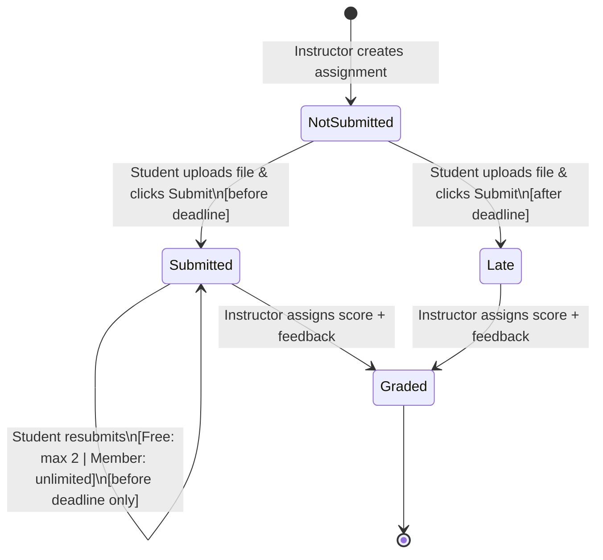
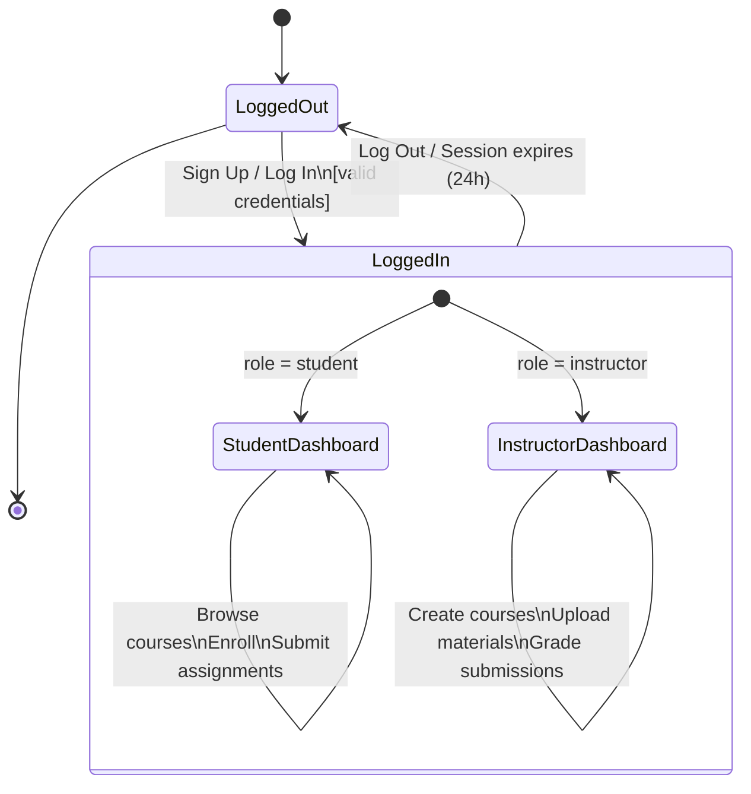
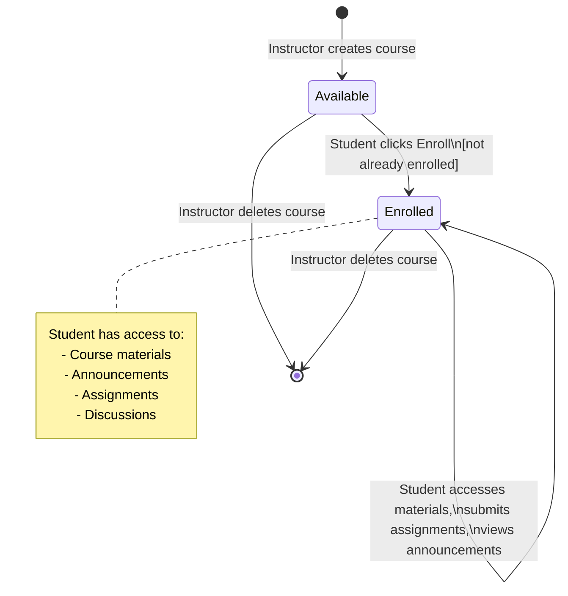
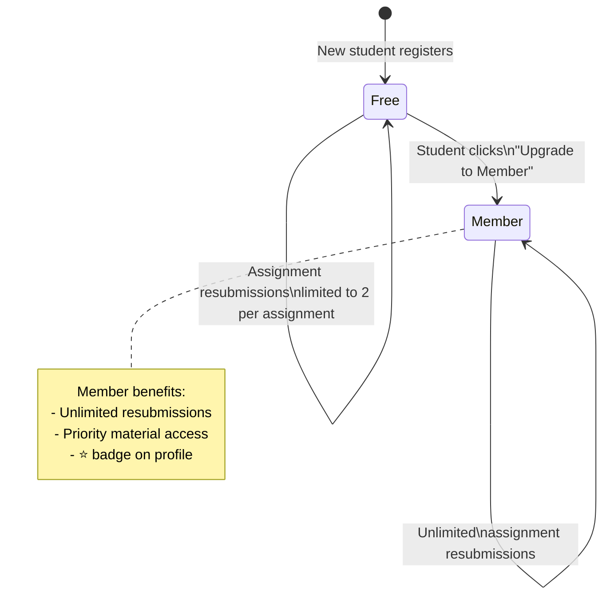
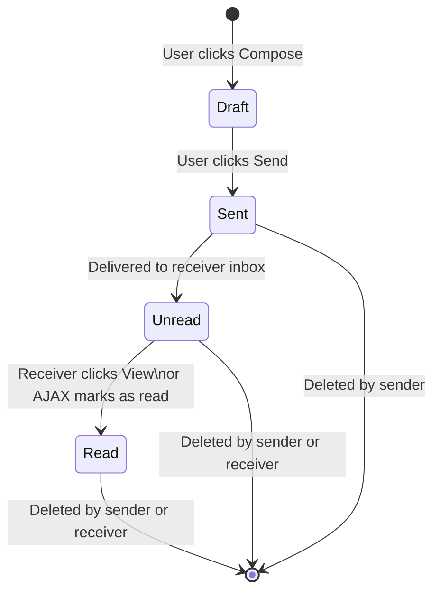
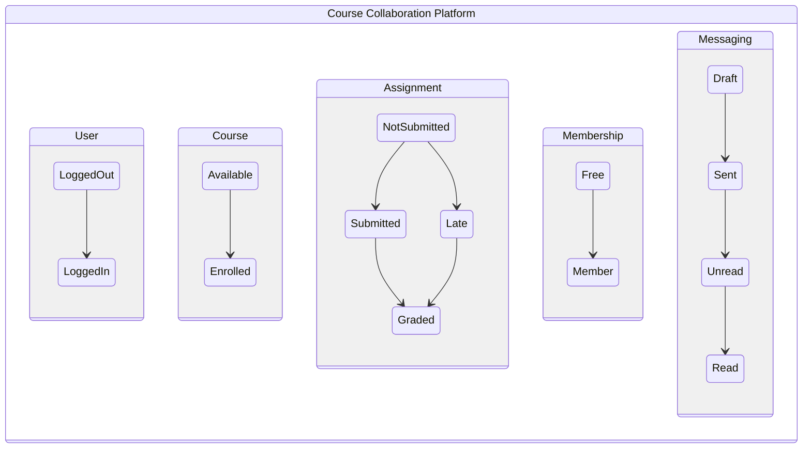

# UML State Diagram — Course Collaboration Platform

## 1. Assignment Submission State Machine

### State Descriptions

| State | Description |
|-------|-------------|
| **NotSubmitted** | Assignment created; student has not yet uploaded a file. The submission record exists with `status = 'not_submitted'`. |
| **Submitted** | Student has uploaded a file before the deadline. `status = 'submitted'`. Student can resubmit (undo + re-upload) subject to membership limits. |
| **Late** | Student uploaded a file after the deadline passed. `status = 'late'`. Resubmission is blocked. |
| **Graded** | Instructor has assigned a numeric score (0–max_score) and optional feedback text. `status = 'graded'`. Terminal state. |

### Transition Guard Conditions

| Transition | Guard |
|------------|-------|
| NotSubmitted → Submitted | `now < due_date AND file uploaded` |
| NotSubmitted → Late | `now >= due_date AND file uploaded` |
| Submitted → Submitted (resubmit) | `now < due_date AND (is_member = true OR resubmission_count < 2)` |
| Submitted → Graded | Instructor provides score 0 ≤ score ≤ max_score |
| Late → Graded | Instructor provides score 0 ≤ score ≤ max_score |

### Transition Actions

| Transition | Action |
|------------|--------|
| → Submitted | Set `submitted_at = now`, store file path, `resubmission_count++` |
| → Late | Set `submitted_at = now`, store file path |
| → Graded | Set `graded_at = now`, store score and feedback |

---

## 2. User Authentication State Machine

---

## 3. Course Enrollment State Machine

---

## 4. Membership State Machine

---

## 5. Message State Machine

---

## Full System Context

